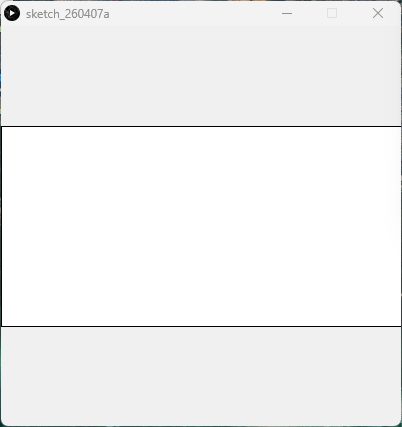

Static Composition - Processing (Python Mode) 
Difficulty Level 1


📌 Overview
Static_Composition is a simple visual sketch written in Processing (Python Mode).
It generates a static 2D composition using basic geometric shapes and color.

This project is intended as an introductory exercise in:
- Creative coding
- Coordinate systems
- Visual balance
- The setup() function in Processing

🖼 Screenshot




Description:
- 400 × 400 pixel canvas
- Light gray background
- A horizontally centered rectangle spanning the full width of the canvas


🛠 Requirements
- Processing (latest version recommended)
- Python Mode enabled in Processing

Installation
1. Download Processing:
 👉 https://processing.org/download
2. Open Processing
3. Select Python Mode from the mode selector (top‑right corner)


▶️ How to Run
1. Open Processing
2. Switch to Python Mode
3. Open Static_Composition.py
4. Click Run ▶

The sketch will render instantly and remain static.

📂 Project Structure
```
.
├── Static_Composition.py
├── README.md
├──Static_Composition/
│	├──Static_Composition.pyde
│	└──Static_Composition.properties
└── assets/
    └── scss.png
```

🧠 Code Explanation
```python
def setup():
    size(400, 400)
    background(240)
    # x, y, width, height
    rect(0, 100, 400, 200)
```

Key Concepts
- setup() 
Runs once when the program starts.

- size(400, 400) 
Defines the canvas size.

- background(240) 
Sets a light gray background.

- rect(0, 100, 400, 200) 
Draws a rectangle across the center of the canvas using:
  - x position
  - y position
  - width
  - height


🎯 Learning Objectives
- Understand Processing’s coordinate system
- Draw basic shapes
- Build visually balanced compositions
- Write clean, minimal creative‑coding sketches


✨ Ideas for Extension
- Add additional shapes for complexity
- Introduce color using fill() and stroke()
- Animate the rectangle using draw()
- Turn this into a generative composition


👤 Author / Context 

Created as part of an introductory creative coding or digital art assignment, focusing on foundational Processing concepts.
