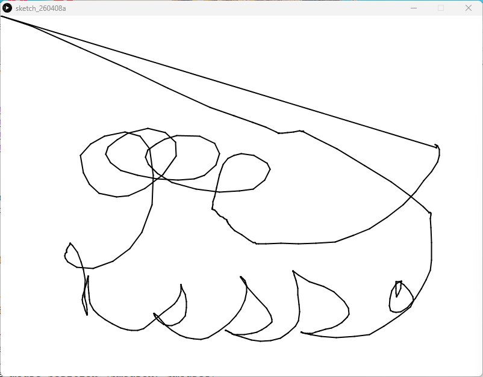

# Interactive Lines - Processing (Python Mode)
### Difficulty Level 2


### 📌 Overview
Interactive Lines is an interactive sketch created in Processing (Python Mode) that explores continuous line drawing through mouse movement.
By connecting the current mouse position to the previous one, the sketch generates expressive, gesture‑based line compositions in real time.
This project introduces the idea of drawing through interaction rather than static shapes.

### 🖼 Screenshot




### ✏️ Visual Concept
The sketch behaves like a digital drawing tool:

- Lines are drawn continuously as the mouse moves
- Each frame connects:
	- The current mouse position (mouseX, mouseY)
	- To the previous mouse position (pmouseX, pmouseY)
- The result is a fluid, organic line trail that records motion over time


The screen is not cleared each frame, allowing the drawing to accumulate.


### 🛠 Requirements
- Processing (latest version recommended)
- Python Mode enabled in Processing

#### Installation
1. Download Processing: 
👉 https://processing.org/download
2. Open Processing
3. Switch to Python Mode


### ▶️ How to Run
1. Open Processing
2. Set mode to Python
3. Open Interactive_Lines.py
4. Click Run ▶
5. Move the mouse around the canvas to draw


### 📂 Project Structure
```
.
├── Interactive Lines.py
├── README.md
├──Interactive Lines/
│	├──Interactive_Lines.pyde
│	└──Interactive_Lines.properties
└── assets/
	└── ilss.png
```


### 🧠 Code Breakdown
```python
def setup():
    size(800, 600)
    background(255)

def draw():
    stroke_weight(2)
    # Connects current mouse to previous mouse position
    line(mouse_x, mouse_y, pmouse_x, pmouse_y)
```

### Key Concepts
- setup() 
Sets the canvas size and initializes the white background.


- draw() 
Runs continuously to capture mouse movement frame‑by‑frame.


- pmouse_x, pmouse_y 
Stores the mouse position from the previous frame, enabling smooth line connections.


- stroke_weight(2) 
Controls line thickness for visual clarity.


### 🎯 Learning Objectives
- Understand how motion can generate form
- Learn the difference between mouseX and pmouseX
- Explore continuous drawing strategies
- Create accumulative visual compositions
- Use interaction as a creative input


### ✨ Ideas for Extension
- Change stroke color dynamically
- Clear the screen with a key press
- Vary line thickness based on speed
- Introduce symmetry or mirroring
- Save drawings as image files


### 👤 Author / Context 

Created as part of an introductory creative coding or digital art assignment, emphasizing interactivity, gesture, and motion‑based drawing in Processing.