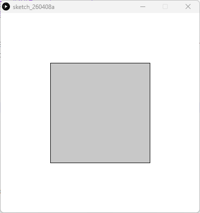

# State Management - Processing (Python Mode)
### Difficulty Level 3


### 📌 Overview
State Management is an interactive sketch written in Processing (Python Mode) that demonstrates state management using conditional logic and mouse input.
The sketch visually responds to whether the mouse button is pressed, changing the appearance of a shape based on the current interaction state.


### 🖼 Screenshot




### 🔁 Interaction Concept
This sketch introduces the idea of binary states:
- Mouse not pressed → one visual state
- Mouse pressed → another visual state

By switching between these states in real time, the sketch shows how interaction can control visual behavior in a program.


### 🛠 Requirements
- Processing (latest version recommended)
- Python Mode enabled in Processing

#### Installation
1. Download Processing: 
👉 https://processing.org/download
2. Open Processing
3. Switch to Python Mode


### ▶️ How to Run
1. Open Processing
2. Set mode to Python
3. Open State_Management.py
4. Click Run ▶
5. Click and hold the mouse to change the square’s appearance


### 📂 Project Structure
```
.
├── State Management.py
├── README.md
├──State Management/
│	├──State_Management.pyde
│	└──State_Management.properties
└── assets/
	└── smss.png
```


### 🧠 Code Breakdown
```python
def draw():
    background(255)

    if mouse_is_pressed:
        fill(0)
    else:
        fill(200)

    rect_mode(CENTER)
    square(width / 2, height / 2, 200)
```


### Key Concepts
- draw() 
Continuously updates the sketch based on current input.

- mouse_is_pressed 
A boolean variable representing interaction state (True or False).

- if / else 
Conditional logic used to switch visual states.

- rect_mode(CENTER) 
Draws the square from its center point for consistent positioning.

- square() 
Renders a centered square whose color reflects the current state.


### 🎯 Learning Objectives
- Understand state management in interactive programs
- Use conditionals (if / else) to control visuals
- Respond to mouse input in real time
- Separate interaction logic from drawing logic
- Reinforce Processing’s animation loop (draw())


### ✨ Ideas for Extension
- Add more states (hover, click‑and‑hold, toggle)
- Change size or rotation instead of color
- Introduce keyboard‑controlled states
- Use transitions or animations between states
- Combine with previous sketches (lines, contrast, background)


### 👤 Author / Context

Created as part of an introductory creative coding or digital art assignment, focusing on interaction logic and visual state changes in Processing.