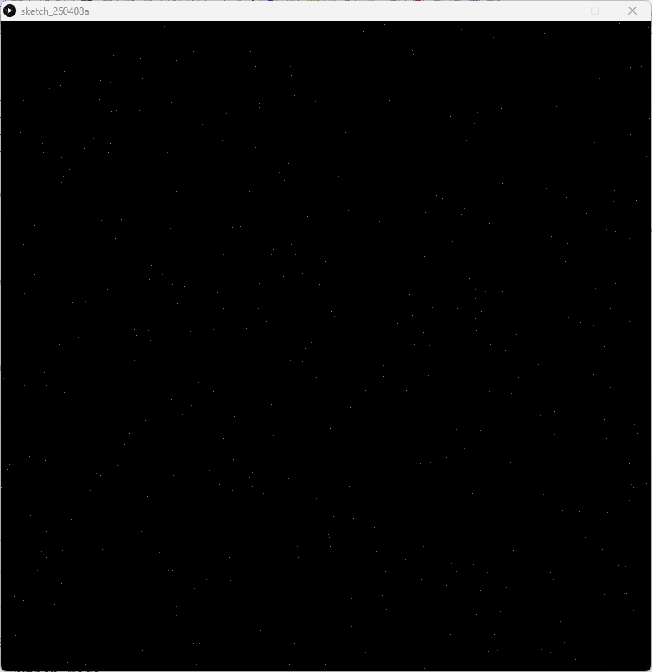

# Random Distribution - Processing (Python Mode)
### Difficulty Level 4


%20Function-orange)


### 📌 Overview
Random Distribution is a generative sketch created in Processing (Python Mode) that explores random distribution through point placement and color variation.
The sketch uses randomness to produce an emergent visual pattern, demonstrating how simple rules can lead to complex and unpredictable results.


### 🖼 Screenshot




### 🎲 Visual Concept
This sketch creates a star‑field–like composition by:
- Randomly placing points across the canvas
- Randomizing color values for each point
- Using repetition combined with randomness
- Drawing all elements once during setup()

Each execution produces a unique composition, even though the code remains the same.


### 🛠 Requirements
- Processing (latest version recommended)
- Python Mode enabled in Processing

#### Installation
1. Download Processing: 
👉 https://processing.org/download
2. Open Processing
3. Switch to Python Mode


### ▶️ How to Run
1. Open Processing
2. Set mode to Python
3. Open Random_Distribution.py
4. Click Run ▶
5. Rerun the sketch to generate a new random composition


### 📂 Project Structure
```
.
├── Random_Distribution.py
├── README.md
├──Random_Distribution/
│	├──Random_Distribution.pyde
│	└──Random_Distribution.properties
└── assets/
	└── rdss.png
```


### 🧠 Code Breakdown
```python
def setup():
    size(800, 800)
    background(0)

    for _ in range(500):
        stroke(random(255), 100, 255)
        point(random(width), random(height))
```

### Key Concepts
- setup() 
Runs once, generating the entire composition at launch.

- for _ in range(500) 
Repeats the drawing process 500 times.

- random(width) / random(height) 
Places points at unpredictable positions across the canvas.

- stroke(random(255), 100, 255) 
Randomizes the red channel while holding green and blue constant, creating visual cohesion within randomness.

- point() 
Draws minimal marks, emphasizing density and distribution.


### 🎯 Learning Objectives
- Understand how randomness affects visual outcomes
- Use random() for position and color
- Combine repetition with unpredictability
- Create generative artwork using simple rules
- Recognize randomness as a design tool, not chaos


### ✨ Ideas for Extension
- Increase or decrease point count
- Animate random placement over time using draw()
- Use Perlin noise instead of pure randomness
- Change background color dynamically
- Introduce shapes instead of points
- Save multiple outputs as a generative series


### 👤 Author / Context

Created as part of an introductory creative coding or digital art assignment, focusing on randomness, generative design, and algorithmic aesthetics in Processing.