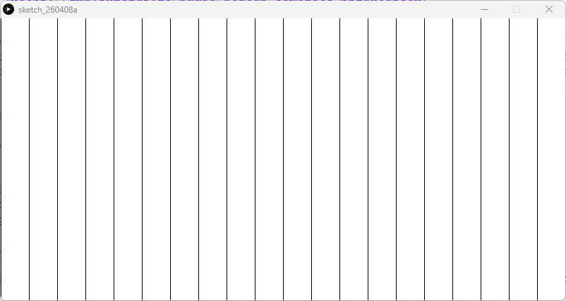

# Repetition Simple For Loop - Processing (Python Mode)
### Difficulty Level 4


### 📌 Overview
Repetition Simple For-Loop is a visual sketch written in Processing (Python Mode) that demonstrates repetition through the use of a for loop.
The sketch creates a rhythmic pattern of evenly spaced vertical lines, illustrating how loops can efficiently generate repeated visual elements across a canvas.


### 🖼 Screenshot




### 🔁 Visual Concept
This sketch explores repetition and structure by:
- Drawing multiple vertical lines
- Evenly spacing them across the width of the canvas
- Using iteration instead of manually drawing each shape

The result is a simple but clear example of how code can create patterns and visual order.


### 🛠 Requirements
- Processing (latest version recommended)
- Python Mode enabled in Processing

#### Installation
1. Download Processing: 
👉 https://processing.org/download
2. Open Processing
3. Switch to Python Mode


### ▶️ How to Run
1. Open Processing
2. Set mode to Python
3. Open Repetition_Simple_For-Loop_Diff_4.py
4. Click Run ▶

The pattern is drawn once and remains static.


### 📂 Project Structure
```
.
├── epetition_Simple_For_Loop.py
├── README.md
├──Repetition_Simple/
│	├──Repetition_Simple.pyde
│	└──Repetition_Simple.properties
└── assets/
	└── rsss.png
```

### 🧠 Code Breakdown
```python
def setup():
    size(800, 400)
    background(255)

    for i in range(0, width, 40):
        line(i, 0, i, height)  # Vertical bars
```


### Key Concepts
-setup() 
Runs once and draws the entire composition.

- for i in range(0, width, 40) 
Iterates across the canvas in fixed increments (every 40 pixels).

- line(i, 0, i, height) 
Draws a vertical line at each step of the loop.

- Repetition through iteration 
One line of code produces many visual elements.


### 🎯 Learning Objectives
- Understand how for loops work
- Use iteration to generate repeated visuals
- Learn how numeric steps affect spacing
- Recognize repetition as a design principle
- Reduce redundant code through loops


### ✨ Ideas for Extension
- Change spacing to alter density
- Alternate colors inside the loop
- Draw horizontal or diagonal lines
- Animate the pattern using draw()
- Combine with motion or interaction
- Introduce nested loops for grids


### 👤 Author / Context

Created as part of an introductory creative coding or digital art assignment, focusing on repetition, iteration, and pattern generation in Processing.