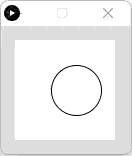

# Perlin Noise - Processing (Python Mode)
### Difficulty Level 5


### 📌 Overview
Perlin Noise is an animated sketch written in Processing (Python Mode) that demonstrates the use of Perlin noise to generate smooth, natural‑looking motion.
Unlike pure randomness, Perlin noise produces continuous, correlated values, making it ideal for organic animation and generative art.


### 🖼 Screenshot




### 🌊 Motion Concept
This sketch explores smooth motion over time by:
- Using Perlin noise instead of random values
- Mapping noise output to horizontal position
- Incrementing a time variable gradually
- Creating fluid left‑to‑right movement without abrupt jumps

The result is motion that feels more natural and less mechanical than traditional randomness.


### 🛠 Requirements
- Processing (latest version recommended)
- Python Mode enabled in Processing


#### Installation
1. Download Processing: 
👉 https://processing.org/download
2. Open Processing
3. Switch to Python Mode


### ▶️ How to Run
1. Open Processing
2. Set mode to Python
3. Open Perlin_Noise.py
4. Click Run ▶
5. Watch the circle move smoothly across the canvas


### 📂 Project Structure
```
.
├── Perlin_Noise.py
├── README.md
├──Perlin_Noise/
│	├──Perlin_Noise.pyde
│	└──Perlin_Noise.properties
└── assets/
	└── pnss.png
```


### 🧠 Code Breakdown
```python
t = 0

def draw():
    global t
    background(255)

    n = noise(t) * width  # Smooth, correlated "random"
    circle(n, height / 2, 50)

    t += 0.01
```


### Key Concepts

- Perlin noise (noise())  
Generates smooth, continuous values between 0 and 1.

- Time variable (t)  
Acts as the input domain for the noise function.

- t += 0.01  
Slowly advances through noise space, ensuring fluid motion.

- noise(t) * width  
Maps noise output to a usable screen position.

- draw() loop  
Continuously updates the animation frame‑by‑frame.


### 🎯 Learning Objectives
- Understand the difference between random values and Perlin noise
- Create smooth, organic animation
- Use time as an input to procedural functions
- Apply noise to motion rather than static visuals
- Reinforce animation fundamentals in Processing


### ✨ Ideas for Extension
- Add vertical Perlin motion using a second noise dimension
- Use noise to control color or size
- Increase complexity with noise(t, y) or noise(x, t)
- Draw trails instead of clearing the background
- Combine Perlin noise with grids or particles
- Create landscape‑like forms using noise curves


### 👤 Author / Context  

Created as part of an introductory creative coding / digital art assignment, focusing on procedural motion, generative animation, and noise‑based systems in Processing.