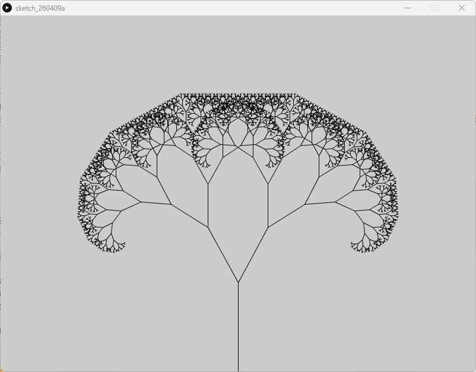

# Recursion The Fractal Tree - Processing (Python Mode)
### Difficulty Level 9


### 📌 Overview
Recursion The Fractal Tree is a Processing (Python Mode) sketch that demonstrates recursion through the generation of a fractal tree.
The sketch defines a function that calls itself to repeatedly draw smaller branches, producing a complex organic form from a simple set of rules. This is a classic example of recursive drawing and self‑similar systems in creative coding.


### 🖼 Screenshot   



### 🌳 Concept Focus: Recursion & Fractals
This sketch explores a fundamental computational idea:
*A function solving a problem by calling itself with a smaller version of that problem.*

Key characteristics demonstrated here:
- Self‑similar structure (branches resemble the whole tree)
- Termination via a base case
- Exponential visual complexity from minimal code
- Use of transformations (translate, rotate) to control recursive space

Fractals like this appear frequently in nature, mathematics, and generative art.


### 🛠 Requirements
- Processing (latest version recommended)
- Python Mode enabled in Processing


### ▶️ How to Run
1.  Open Processing
2. Switch to Python Mode
3. Open Recursion_The_Fractal_Tree.py
4. Click Run ▶

A fractal tree will render, growing upward from the bottom center of the canvas.

### 📂 Project Structure
```
.
├── Recursion_The_Fractal_Tree.py
├── README.md
├──Recursion_The_Fractal_Tree/
│	├──Recursion_The_Fractal_Treee.pyde
│	└──Recursion_The_Fractal_Tree.properties
└── assets/
	└── ftss.png
```


### 🧠 Code Breakdown   
Recursive Branch Function
```python
def branch(length):
    line(0, 0, 0, -length)
    translate(0, -length)

    if length > 4:
        push_matrix()
        rotate(0.5)
        branch(length * 0.7)
        pop_matrix()

        push_matrix()
        rotate(-0.5)
        branch(length * 0.7)
        pop_matrix()
```


### Key Concepts:
- Recursive call   
branch() calls itself with a smaller length.

- Base case   
Recursion stops when length <= 4.

- Transform stacking   
push_matrix() and pop_matrix() isolate transformations so branches don’t interfere with one another.

- Rotation control   
Positive and negative rotations create symmetrical branching.

Initialization   
```python
def setup():
    size(800, 600)
    translate(width / 2, height)
    branch(150)
```


- The coordinate system is moved to the bottom center of the screen.
- The initial branch length defines the overall scale of the tree.
- The entire tree is generated from a single function call.


### 🎯 Learning Objectives
- Understand recursion in practice
- Implement a base case to prevent infinite loops
- Use transformations recursively
- Explore fractals and self‑similarity
- Combine mathematics with organic visual form
- Learn stack‑based transformation control
- See how complexity emerges from simple rules


### ✨ Ideas for Extension
- Animate branch angles over time
- Randomize angles or branch length
- Add color or thickness variation by depth
- Track recursion depth explicitly
- Create asymmetric or wind‑affected trees
- Combine with Perlin noise for organic motion
- Turn branches into leaves or particle emitters
- Generate forests instead of a single tree


### 👤 Author / Context   
Created as part of an advanced creative coding / digital art curriculum, focusing on recursion, fractal geometry, and algorithmic form generation in Processing.