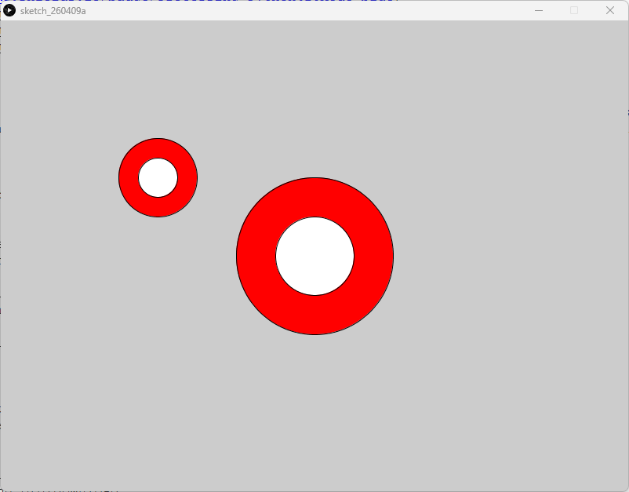

# Custom Functions - Processing (Python Mode)
### Difficulty Level 6


### 📌 Overview
Custom Functions is a Processing (Python Mode) sketch that introduces custom function definitions as a way to organize, reuse, and simplify drawing code.
The sketch defines a reusable function that draws a target‑like graphic, then calls it multiple times with different parameters to create variation from a single abstraction.


### 🖼 Screenshot   



### 🧠 Concept Focus
This sketch demonstrates procedural abstraction, a core programming concept where:
- A repeated visual idea is turned into a function
- Parameters control position and size
- The same logic can be reused without duplication

Custom functions help make code more readable, flexible, and scalable.


### 🛠 Requirements
- Processing (latest version recommended)
- Python Mode enabled in Processing

#### Installation
1. Download Processing: 
👉 https://processing.org/download
2. Open Processing
3. Switch to Python Mode


### ▶️ How to Run
1. Open Processing
2. Set mode to Python
3. Open Custom_Functions.py
4. Click Run ▶

The sketch will render multiple target shapes using the same custom function.


### 📂 Project Structure
```
.
├── Custom_Functions.py
├── README.md
├──Custom_Functions/
│	├──Custom_Functions.pyde
│	└──Custom_Functions.properties
└── assets/
	└── cfss.png
```


### 🧠 Code Breakdown
```python
def draw_target(x, y, size):
    fill(255, 0, 0)
    circle(x, y, size)

    fill(255)
    circle(x, y, size * 0.5)

def setup():
    size(800, 600)
    draw_target(200, 200, 100)
    draw_target(400, 300, 200)
```

### Key Concepts
- Custom function definition   
draw_target(x, y, size) encapsulates a repeated drawing pattern.

- Parameters
	- x, y control position
	- size controls scale

- Function calls   
The same function is reused with different arguments to produce variation.

- Code reuse   
Visual complexity increases without increasing code repetition.

- setup()   
Draws a static composition using multiple function calls.


### 🎯 Learning Objectives
- Define and use custom functions
- Understand parameters and arguments
- Reduce code duplication
- Improve readability and structure
- Build scalable drawing systems
- Transition from drawing commands to procedural design


### ✨ Ideas for Extension
- Add more rings to the target
- Animate targets inside draw()
- Randomize position and size
- Store target data in arrays or lists
- Use nested functions with loops
- Turn targets into interactive elements


### 👤 Author / Context   
Created as part of an introductory creative coding / digital art assignment, focusing on abstraction, modularity, and procedural thinking in Processing.