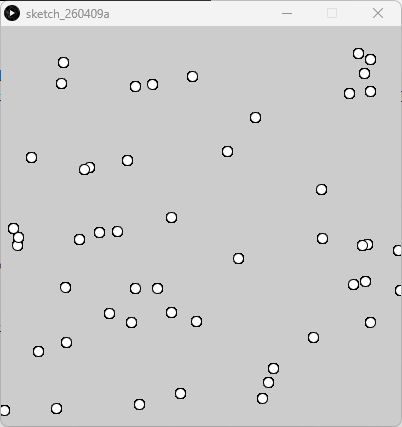

# The Particle Class - Processing (Python Mode)
### Difficulty Level 7


### 📌 Overview
The Particle Class is a Processing (Python Mode) sketch that introduces the particle system paradigm using object‑oriented programming.
Each particle is represented as an independent object with its own position and display behavior. Multiple particles are stored and managed collectively, forming the basis of scalable generative and interactive systems.


### 🖼 Screenshot   



### ⚛️ Concept Focus: Particle Systems
This sketch demonstrates a core creative‑coding pattern:
- Many small, simple objects
- Each object behaves the same way
- The system’s complexity emerges from quantity, not complexity

Particle systems are widely used for:
- Generative art
- Motion graphics
- Visual effects
- Simulations (snow, dust, fire, swarms)


### 🛠 Requirements
- Processing (latest version recommended)
- Python Mode enabled in Processing

#### Installation
1. Download Processing: 
👉 https://processing.org/download
2. Open Processing
3. Switch to Python Mode


### ▶️ How to Run
1. Open Processing
2. Set mode to Python
3. Open The_Particle_Class.py
4. Click Run ▶

The sketch displays a field of particles randomly distributed across the canvas.


### 📂 Project Structure
```
.
├── The_Particle_Class.py
├── README.md
├──The_Particle_Class/
│	├──The_Particle_Class.pyde
│	└──The_Particle_Class.properties
└── assets/
	└── pcss.png
```


### 🧠 Code Breakdown
#### Particle Class
```python
class Particle:
    def __init__(self):
        self.x = random(width)
        self.y = random(height)

    def display(self):
        circle(self.x, self.y, 10)
```
Key ideas:
- Each particle is an object
- Position is randomized at creation
- Behavior (display) is encapsulated inside the class

#### Particle Collection
```python
particles = []
```
- Stores all particle instances
- Allows system‑level control through iteration

#### Setup
```python
def draw():
    for p in particles:
        p.display()
```
- Initializes the canvas
- Generates 50 particle objects
- Demonstrates mass object creation with minimal code

#### Draw Loop
```python
def draw():
    for p in particles:
        p.display()
```
- Iterates over all particles
- Calls each particle’s display behavior
- Manages complexity at the system level


### 🎯 Learning Objectives
- Understand the particle system pattern
- Use classes to model repeated elements
- Store and manage objects in lists
- Separate object behavior from system logic
- Transition from static visuals to scalable systems
- Prepare for motion, interaction, and forces


### ✨ Ideas for Extension
- Add velocity and movement to particles
- Introduce lifespan and fading
- Respond to mouse or keyboard interaction
- Apply Perlin noise to motion
- Connect nearby particles visually
- Turn particles into a physics‑based system
- Merge with earlier sketches (noise, trigonometry, interaction)


### 👤 Author / Context   
Created as part of an advanced stage of an introductory creative coding / digital art assignment, focusing on particle systems, object‑oriented thinking, and emergent visual structure in Processing.