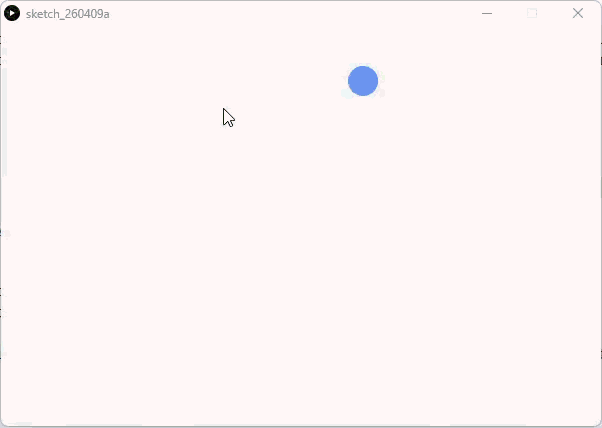

# Vectors and Physics - Processing (Python Mode)
### Difficulty Level 7


### 📌 Overview
Vectors and Physics is an animated sketch written in Processing (Python Mode) that introduces vector‑based motion as a foundation for physics‑driven behavior.
Instead of managing position with separate x and y variables, the sketch uses vectors to represent motion more naturally and efficiently, mirroring how movement is modeled in real‑world physics systems.


### 🖼 Screenshot   



### ➡️ Motion & Physics Concept
This sketch demonstrates key physics concepts used widely in creative coding:
- Position as a vector
- Velocity as a vector
- Motion created by adding velocity to position each frame
- Boundary collision with directional reversal

Using vectors allows motion logic to scale easily when adding forces, acceleration, gravity, or interaction.


### 🛠 Requirements
- Processing (latest version recommended)
- Python Mode enabled in Processing
- Vector support (Py5Vector or Processing vector equivalent)

#### Installation
1. Download Processing: 
👉 https://processing.org/download
2. Open Processing
3. Switch to Python Mode


### ▶️ How to Run
1. Open Processing
2. Set mode to Python
3. Open Vectors_and_Physics.py
4. Click Run ▶
5. Observe the circle moving and bouncing horizontally across the canvas


### 📂 Project Structure
```
.
├── Vectors_and_Physics.py
├── README.md
├──Vectors_and_Physics/
│	├──Vectors_and_Physics.pyde
│	└──Vectors_and_Physics.properties
└── assets/
	└── vpss.gif
```


### 🧠 Code Breakdown
#### Vector Initialization
```python
pos = Py5Vector(100, 100)
vel = Py5Vector(2, 5)
```
- pos represents the object’s current position
- vel represents direction and speed
- Vectors combine x and y values into a single structure

#### Animation Logic
```python
def draw():
    global pos, vel
    background(240)
    pos += vel
```
- Each frame, velocity is added to position
- This simple rule produces continuous motion

#### Boundary Interaction
```python
if pos.x > width or pos.x < 0:
        vel.x *= -1
    if pos.y > height or pos.y < 0:
        vel.y *= -1
```
- Detects collision with left and right boundaries
- Reverses horizontal velocity using vector math
- Demonstrates basic elastic collision behavior

#### Rendering
```python
circle(pos.x, pos.y, 30)
```
- Draws the moving object based on vector position
- Separates motion logic from visual representation


### 🎯 Learning Objectives
- Understand vectors as position and velocity
- Use vector addition to create motion
- Apply conditional logic for boundary collisions
- Prepare for physics‑based systems (forces, acceleration)
- Transition from manual motion to scalable physics modeling
- Build a foundation for particle and simulation systems


### ✨ Ideas for Extension
- Add acceleration (acc) as a third vector
- Introduce gravity or friction
- Handle vertical boundary collisions
- Apply Perlin noise as a force
- Create multiple vector‑based particles
- Combine with the particle system sketch
- Add mouse‑controlled forces or attraction


### 👤 Author / Context   
Created as part of an advanced stage of an introductory creative coding / digital art assignment, focusing on vector math, physics principles, and motion systems in Processing.