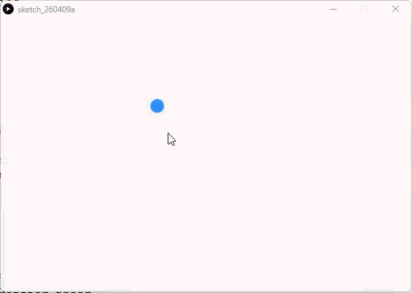

# Autonomous Agents - Processing (Python Mode)
### Difficulty Level 10


### 📌 Overview
Autonomous Agents is an advanced Processing (Python Mode) sketch that introduces autonomous agents—self‑directed entities that move through space according to internal rules and environmental stimuli.
In this simplified example, an agent continuously seeks the mouse position using vector‑based steering logic, laying the groundwork for more complex behaviors such as flocking, avoidance, pursuit, and emergent systems.


### 🖼 Screenshot   



### 🤖 Concept Focus: Autonomous Behavior
Autonomous agents are a foundational concept in:
- Artificial life (A‑Life)
- Game AI
- Swarm systems
- Crowd simulation
- Generative art
- Interactive installations

Rather than being directly controlled, agents:
- Sense their environment
- Decide how to act
- Move based on internal physics

This sketch models that idea using steering behavior, popularized by Craig Reynolds.


### 🛠 Requirements
- Processing (latest version recommended)
- Python Mode
- Vector support (Py5Vector or equivalent Processing vector class)


### ▶️ How to Run
1. Open Processing
2. Switch to Python Mode
3. Open Autonomous_Agents.py
4. Click Run ▶
5. Move the mouse around the screen
6. Observe the agent steering toward the cursor


### 📂 Project Structure
```
.
├── Autonomous_Agents.py
├── README.md
├──Autonomous_Agents/
│	├──Autonomous_Agents.pyde
│	└──Autonomous_Agents.properties
└── assets/
	└── aass.gif
```


### 🧠 Code Breakdown
#### Target Acquisition
```python
target = Py5Vector(mouse_x, mouse_y)
```
- The agent uses the mouse as a dynamic target
- Treats user input as environmental stimulus

### Desired Velocity
```python
desired = target - pos
desired.set_mag(5)
```
- Computes the vector pointing toward the target
- Normalizes and scales it to a desired speed
- Represents where the agent wants to go

### Steering Logic (Conceptual)
```python
# Check magnitude using the property
    d_mag = desired.mag
    if d_mag > 0:
        # 1. SET MAGNITUDE: (vector / current_mag) * new_mag
        # This is the manual way to 'set_mag(5)'
        desired = (desired / d_mag) * 5
        
        # 2. STEERING: Steering = Desired - Velocity
        steering = desired - vel
        
        # 3. LIMIT: If steering is stronger than 0.2, scale it down
        s_mag = steering.mag
        if s_mag > 0.2:
            steering = (steering / s_mag) * 0.2
        
        # 4. APPLY PHYSICS
        vel += steering
        pos += vel
```
- Steering force is the difference between:
	- Desired motion
	- Current velocity
- Prevents instant snapping to the target
- Produces smooth, lifelike motion

This separation between desire and capability is what gives agents their natural behavior.


### 🎯 Learning Objectives
- Understand autonomous agents vs direct control
- Use vectors to model intent and motion
- Implement seeking behavior
- Apply steering forces rather than absolute movement
- Build systems that respond to the environment
- Prepare for multi‑agent and emergent simulations


### ✨ Ideas for Extension
- Add multiple agents
- Implement flocking (separation, alignment, cohesion)
- Add obstacle avoidance
- Introduce arrival (slow down near target)
- Combine with Perlin noise for wandering
- Add trails to visualize paths
- Use audio or image data as steering targets
- Integrate with particle or physics systems
- Make agents repel or attract each other


### 👤 Author / Context   
Created as part of an advanced creative coding / digital art curriculum, focusing on autonomous systems, steering behaviors, and agent‑based design in Processing.