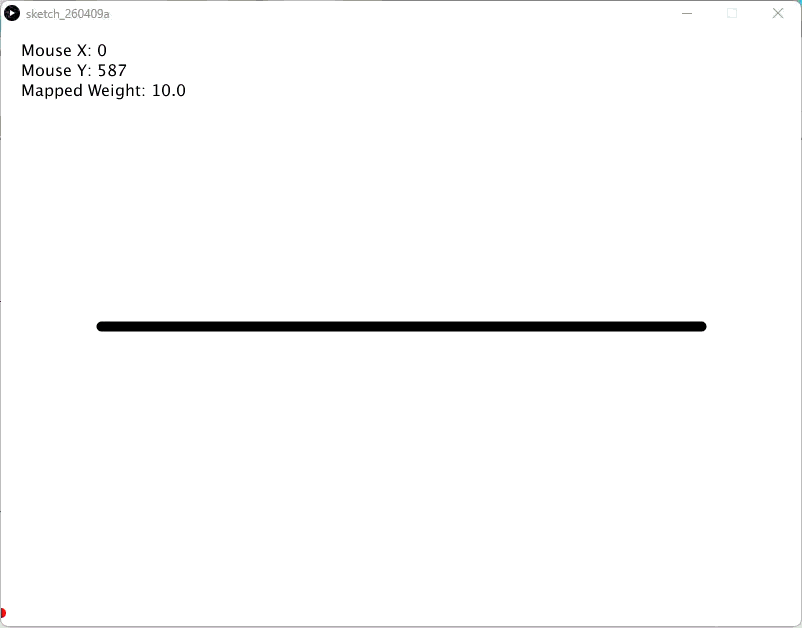

# Mapped Inputs - Processing (Python Mode)
### Difficulty Level 8


### 📌 Overview
Mapped Inputs is an interactive Processing (Python Mode) sketch that demonstrates input mapping—the technique of translating raw user input values into a different, more useful range.
The sketch maps horizontal mouse movement to line thickness, illustrating how interaction data can be scaled, normalized, and repurposed to control visual parameters.


### 🖼 Screenshot   
   
   


### 🎚 Concept Focus: Mapping Input to Output
This sketch introduces a foundational interaction design concept:
- Raw input values (mouse position) are often not directly usable
- Mapping allows inputs to be scaled and constrained
- Small gestures can drive large visual changes (or vice versa)

Input mapping is essential for:
- Interactive art
- Immersive installations
- Sensor‑based systems
- Audio‑visual performance tools


### 🛠 Requirements
- Processing (latest version recommended)
- Python Mode enabled in Processing
- A remap() utility function available in your environment
(or equivalent mapping function)


### ▶️ How to Run
1. Open Processing
2. Set mode to Python
3. Open Mapped_Inputs.py
4. Click Run ▶
5. Move the mouse left and right to change the line’s thickness


### 📂 Project Structure
```
.
├── Mapped_Inputs.py
├── Mapped_Inputs_Dynamic_Ivy.py
├── Mapped_Inputs_Dynamic_Ivy_Wind.py
├── README.md
├──Mapped_Inputs/
│	├──Mapped_Inputs.pyde
│	└──Mapped_Inputs.properties
├──Mapped_Inputs_Dynamic_Ivy/
│	├──Mapped_Inputs_Dynamic_Ivy.pyde
│	└──Mapped_Inputs_Dynamic_Ivy.properties
├──Mapped_Inputs_Dynamic_Ivy_Wind/
│	├──Mapped_Inputs_Dynamic_Ivy_Wind.pyde
│	└──Mapped_Inputs_Dynamic_Ivy_Wind.properties
└── assets/
	├──miss.gif
	├──midiss.gif
	└──midiwss.gif	
```


### 🧠 Code Breakdown
```python
def draw():
    # Maps mouse from 0-width to 10-200 stroke weight
    w = remap(mouse_x, 0, width, 10, 200)

    background(255)
    stroke_weight(w)
    line(100, 300, 700, 300)
```


### Key Concepts
- mouse_x  
Provides raw input in the range 0 → width

- remap()  
Translates input from one range to another

- Input range: 0 → width  
Output range: 10 → 200

- Mapped output (w)  
Used to control stroke_weight

- Visual feedback  
A single line makes the mapping relationship easy to read


### 🎯 Learning Objectives
- Understand input/output mapping
- Normalize and scale user input
- Design responsive visual controls
- Separate raw sensor values from visual behavior
- Build intuition for interactive parameter control


### ✨ Ideas for Extension
- Map mouse Y‑position to color or transparency
- Use map() or custom easing curves
- Clamp values to prevent extremes
- Map inputs to multiple parameters simultaneously
- Combine with audio or sensor data
- Use mapping for physics forces or particle behavior
- Visualize the input curve explicitly on screen


### 👤 Author / Context   
Created as part of an advanced creative coding / digital art assignment, focusing on interaction design, data normalization, and responsive visual systems in Processing.